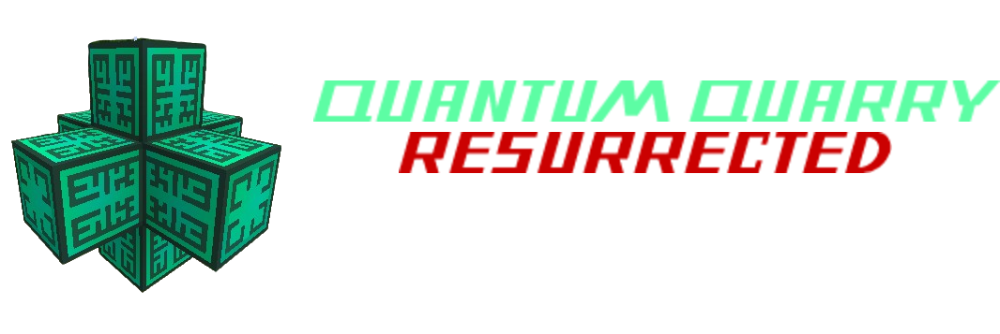
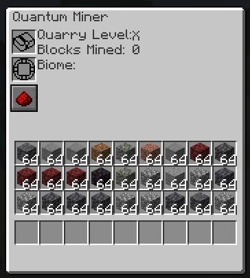

# Quantum Quarry Mod

Welcome to the **Quantum Quarry Mod**! This mod introduces an advanced mining system that allows players to mine entire chunks of alternative dimensions. The mod is designed to provide a user based mining experience, including caves, fluids, structures, loot chests, and more.

---

## Features

### 🌍 **Quantum Quarry**
- A high-tech block that mines resources from entire chunks.
- Fully customizable with enchantments to enhance mining efficiency and tailor the resources gathered.
- Can be powered with Redstone signals to enable or disable operations dynamically.

### 🛠️ **Miners**
- Auxiliary blocks that interact with the Quarry Core.
- Act as proxy blocks, enabling redstone control and energy transfer.
- Show the Quarry Core's energy status when hovered over with compatible mods like Jade or The One Probe.

### ⚡ **Energy Integration**
- Fully compatible with NeoForge energy systems.
- The Quarry Core and Miner Blocks consume energy for each block mined.

### 🏗️ **Structure Validation**
- The Quarry operates only when a valid structure is built around the core.

### 📖 **Custom Enchantments**
- Enhance the Quarry's mining tool using enchanted books.
- Supports vanilla enchantments and third-party mod integrations.

### 🌐 **Biome-Specific Mining**
- Use Biome Markers to target specific biomes for mining.
- Dynamically adapts to the player's needs.

---

## Installation

1. **Download the mod**:
   - [Release Page](https://github.com/DeadmanLabs/Quantum-Quarry-Resurrection/releases) (placeholder link)

2. **Requirements**:
   - Minecraft Version: 1.21
   - NeoForge: Version 1.21.x or higher

3. **Installation Steps**:
   - Place the downloaded `.jar` file in your Minecraft `mods` folder.
   - Launch Minecraft with NeoForge installed.

---

## How to Use

### 🏗️ **Setting up the Quantum Quarry**
1. Place the **Quarry Core** in a suitable area.
2. Surround the core with **Miners** to enable functionality.
3. Ensure the Quarry is powered with energy and configured with valid storage tanks and chests.

### 📚 **Enchanting**
- Insert enchanted books into the Quarry GUI to apply custom mining effects.
- Supported enchantments include vanilla and modded ones.

### 🌍 **Biome Mining**
- Use a **Biome Marker** in the Quarry's GUI to select a specific biome to mine resources from.

### ⚡ **Power Requirements**
- The Quarry consumes energy for each block mined.
- Ensure sufficient energy is supplied to avoid interruptions.

### **Menu**

---

## Modpack Integration

The Quantum Quarry Mod is fully compatible with most modpacks and supports:
- **Energy Mods**: Compatible with Forge energy systems.
- **Storage Mods**: Automatically integrates with vanilla and modded storage solutions.
- **Biome Mods**: Supports custom biomes and dimensions.

---

## Contributing

We welcome contributions to the mod! Here's how you can help:
1. Fork the repository.
2. Create a new branch (`feature/my-feature`).
3. Commit your changes and open a pull request.

Feel free to report bugs or suggest new features through the [Issues](https://github.com/DeadmanLabs/Quantum-Quarry-Resurrection/issues) tab.

---

## License

This mod is distributed under the MIT License. See `LICENSE` for more details.

---

## Credits

- **Mod Development**: DeadmanLabs
- **Special Thanks**: RWTema / Extra Utilities 2, NeoForge, and Minecraft Modding Community

Enjoy the Quantum Quarry Mod! 🚀
